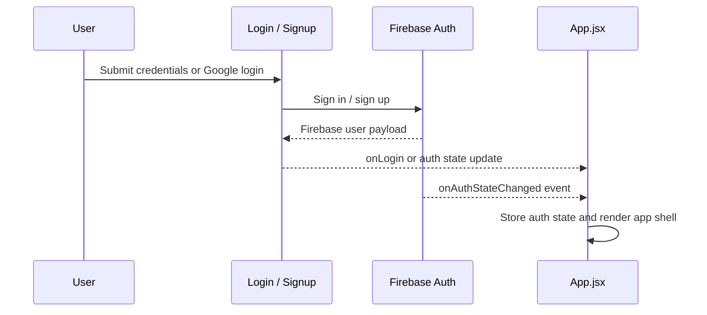
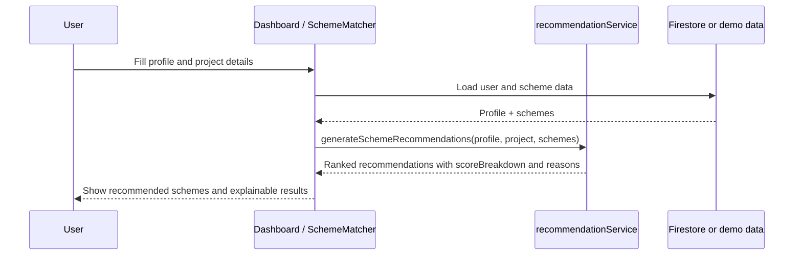
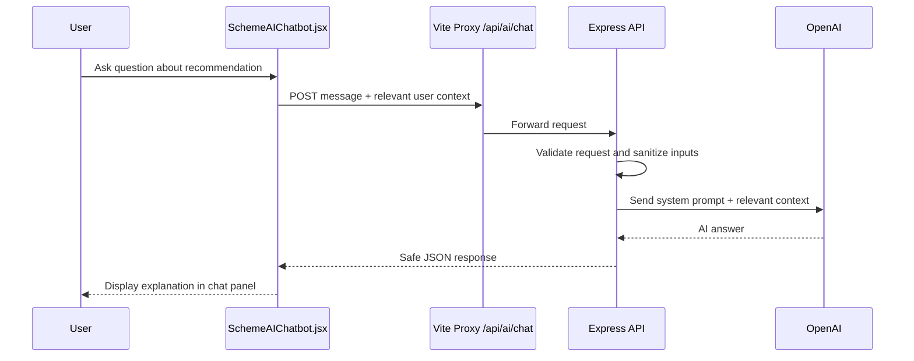

# Scheme Sathi Architecture

## 1. Overview

Scheme Sathi is a React + Vite web application designed to help entrepreneurs discover relevant government and financial schemes, estimate potential support, and understand scheme fit through explainable recommendation logic and AI-powered guidance.

The system is built around an authenticated user workspace, a recommendation engine, optional AI explanation, and Firebase-backed profile and scheme data. The architecture prioritizes clarity, safe fallback behavior, and modular service boundaries without over-engineering the product.

## 2. High-Level Architecture

```mermaid
flowchart TD
    User[User] --> Browser[Browser / React Client]
    Browser --> App[App.jsx]
    App --> Auth[Firebase Auth]
    App --> UI[Authenticated UI Shell]

    UI --> Dashboard[Dashboard.jsx]
    UI --> Matcher[SchemeMatcher.jsx]
    UI --> Details[SchemeDetails.jsx]
    UI --> Profile[Profile.jsx]
    UI --> Calculator[Calculator.jsx]
    UI --> Partners[Partners.jsx]

    Dashboard --> RecSvc[recommendationService.js]
    Matcher --> RecSvc
    Details --> RecSvc

    RecSvc --> SchemeData[Firestore / demo scheme data]
    User --> ProfileData[Firebase user profile]

    Browser --> AIProxy[/api/ai/chat via Vite proxy]
    AIProxy --> Backend[Express server]
    Backend --> OpenAI[OpenAI API]

    Backend --> Env[.env / server environment vars]
    App --> FirebaseConfig[Firebase web config]
    FirebaseConfig --> Firebase[(Firebase Auth + Firestore)]
```

## 3. Architectural Layers

### 3.1 Presentation Layer
Location: `src/Pages`, `src/Components`

Responsibilities:
- render authenticated application screens
- display scheme recommendations, statistics, and partner cards
- collect user profile and project inputs
- invoke recommendation logic and AI chatbot
- maintain responsive layout and page navigation

Core frontend modules:
- `src/App.jsx` — app bootstrap, auth state, route/state selection
- `src/Pages/Dashboard.jsx` — main user dashboard and recommendation summary
- `src/Pages/SchemeMatcher.jsx` — user input for matching projects and schemes
- `src/Pages/SchemeDetails.jsx` — detailed scheme view and document guidance
- `src/Components/SchemeAIChatbot.jsx` — floating AI assistant panel
- `src/Components/Sidebar.jsx` — navigation shell
- `src/Components/SchemeCard.jsx` — scheme cards for dashboard listings

### 3.2 Domain Logic Layer
Location: `src/firebase` and `src/utils`

Responsibilities:
- normalize user profile data
- load schemes and user records from Firestore
- calculate deterministic match scores
- format recommendation breakdowns with safe guards for null and missing values
- keep recommendation logic independent from UI rendering

Key modules:
- `src/firebase/recommendationService.js` — score calculation and explainable recommendation structure
- `src/firebase/schemeService.js` — fetch active schemes from Firestore
- `src/firebase/userService.js` — create/get/update user profile records
- `src/firebase/partnerService.js` — channel partner retrieval and sorting
- `src/firebase/aiService.js` — frontend-safe AI request wrapper

### 3.3 Backend AI Layer
Location: `server/`

Responsibilities:
- expose secure API for AI requests
- validate user-provided payloads
- keep `OPENAI_API_KEY` outside the browser
- send relevant user context and recommendation summaries to OpenAI
- return safe, user-friendly responses

Key modules:
- `server/server.js` — Express app bootstrap and API registration
- `server/routes/aiRoutes.js` — chat endpoint validation and request handling
- `server/services/openaiService.js` — OpenAI SDK integration and system prompt

### 3.4 Data Layer
Primary sources:
- Firebase Authentication for session management
- Firestore for user profiles, scheme records, and application states
- Local demo data for fallback when Firestore is empty or unavailable

Important data files:
- `src/firebase.js` — client Firebase initialization
- `src/firebase/firestore.js` — shared Firestore helpers and upload utility
- `src/data/schemes.js` — fallback scheme catalog
- `src/data/partners.js` — fallback partner list

## 4. Request Flow

### 4.1 Authentication Flow


### 4.2 Scheme Recommendation Flow


### 4.3 AI Assistant Flow


## 5. Recommendation Engine Design

The recommendation engine is deterministic and explainable rather than random or opaque.

### Key design principles
- do not guess or overstate eligibility
- treat missing fields as incomplete data instead of failure conditions
- calculate scores from structured fields such as age, income, category, location, project type, and loan requirement
- store explanation metadata with each result
- keep scores understandable to the user

### Recommendation object
Each recommendation may include:
- `score`
- `scoreBreakdown`
- `eligibleReasons`
- `concerns`
- `missingInformation`
- `nextSteps`
- `requiredDocuments`

This structure allows the UI and AI assistant to explain why a scheme appears relevant without guaranteeing approval.

## 6. Security Model

### Frontend security
- never place the OpenAI key in a React component or Vite env variable exposed to the browser
- keep sensitive keys in the backend `.env`
- do not send passwords, auth tokens, or unrelated personal data to the AI service
- only send minimal relevant profile and recommendation context

### Backend security
- validate required request fields
- avoid leaking internal stack traces to the client
- return generic safe error payloads
- ensure API keys remain server-side

## 7. Error Handling Strategy

The app is designed to degrade gracefully:
- Firebase failures fall back to demo scheme and partner data
- missing Firestore fields are handled safely
- empty arrays and undefined values do not crash the dashboard
- recommendation logic never assumes every scheme contains every property
- AI failures return a safe message instead of exposing backend internals

## 8. UI / UX Architecture

The user interface follows a simple and predictable shell:
- persistent sidebar navigation
- top navigation with user summary and logout
- dashboard with recommendation cards and stat blocks
- scheme detail page with document guidance
- floating AI chat assistant available on key screens

The UI avoids over-splitting business logic into page-specific logic and keeps common behavior in reusable service and component layers.

## 9. Dependency and Technology Stack

### Frontend
- React 19
- Vite
- JavaScript + JSX
- CSS modules / custom CSS patterns
- Lucide icons
- Firebase SDK for Auth and Firestore

### Backend
- Node.js
- Express
- OpenAI SDK
- dotenv for environment variable loading
- CORS for frontend-backend communication

## 10. Project Structure

```text
scheme-sathi/
├── src/
│   ├── App.jsx
│   ├── main.jsx
│   ├── index.css
│   ├── Components/
│   │   ├── Navbar.jsx
│   │   ├── Sidebar.jsx
│   │   ├── StatCard.jsx
│   │   ├── SchemeCard.jsx
│   │   ├── SchemeAIChatbot.jsx
│   │   └── SchemeAIChatbot.css
│   ├── Pages/
│   │   ├── Dashboard.jsx
│   │   ├── SchemeMatcher.jsx
│   │   ├── SchemeDetails.jsx
│   │   ├── Login.jsx
│   │   ├── Signup.jsx
│   │   ├── Profile.jsx
│   │   ├── Partners.jsx
│   │   └── Calculator.jsx
│   ├── firebase/
│   │   ├── auth.js
│   │   ├── schemeService.js
│   │   ├── recommendationService.js
│   │   ├── partnerService.js
│   │   ├── userService.js
│   │   ├── aiService.js
│   │   └── firestore.js
│   ├── data/
│   │   ├── schemes.js
│   │   └── partners.js
│   └── utils/
│       └── digitalTwin.js
├── server/
│   ├── server.js
│   ├── routes/
│   │   └── aiRoutes.js
│   └── services/
│       └── openaiService.js
├── .env.example
├── .gitignore
├── package.json
├── vite.config.js
├── README.md
└── Architecture.md
```

## 11. Scalability and Extensibility

This architecture supports incremental growth:
- new pages can be added without affecting the auth shell
- recommendation scoring can evolve with more scheme criteria
- AI responses can be expanded with more user scenario context
- Firestore can replace fallback demo data as the app matures
- the backend API can later support analytics, document summaries, or partner matching

## 12. Design Summary

Scheme Sathi uses a modular frontend-server architecture with clear boundaries:
- the client handles user experience and local state
- Firebase handles identity and persistence
- the recommendation engine performs deterministic scoring
- the backend API ensures OpenAI is used securely and responsibly
- the AI assistant explains results without making guarantees of eligibility or approval

This makes the project easy to extend while keeping the product safe, explainable, and understandable for end users.
