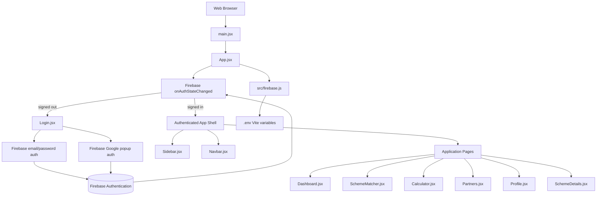
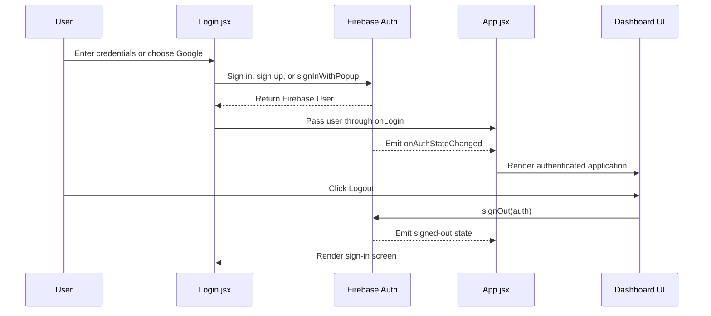
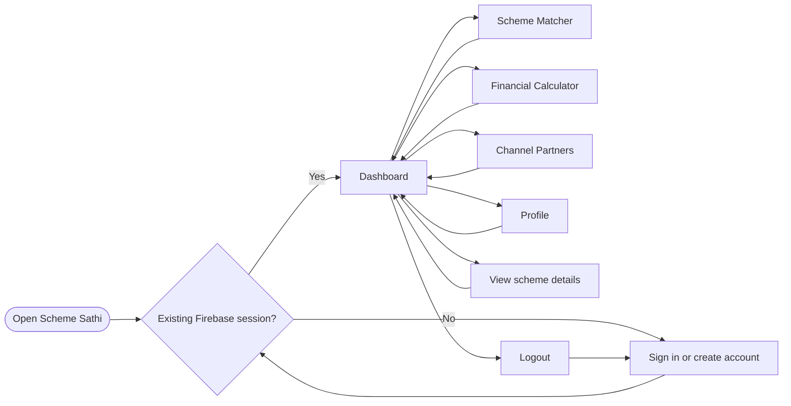

# Scheme Sathi

Scheme Sathi is a React and Vite platform that helps Indian entrepreneurs discover government schemes, compare eligibility, estimate financial support, and connect with channel partners.

The application combines a focused dashboard experience with Firebase Authentication, including email/password accounts and Google sign-in.

## Screenshots

### Sign in


### Create an account


## Features

- Firebase email/password authentication
- Google sign-in with Firebase popup authentication
- Password reset email flow
- Persistent authentication across page refreshes
- Dashboard with scheme discovery and statistics
- Scheme matcher for finding relevant government schemes
- Financial calculator for planning support and funding
- Channel partner directory
- User profile view
- Scheme detail pages with back navigation
- Responsive card-based interface with Hindi/English navigation affordance

## Application Architecture



## Authentication Flow



## User Flow



## Tech Stack

- **Frontend:** React 19
- **Build tool:** Vite
- **Authentication:** Firebase Authentication
- **Styling:** CSS with the existing Inter-based visual system and `#4f46e5` primary color
- **Language:** JavaScript with JSX

## Project Structure

```text
src/
├── App.jsx
├── firebase.js
├── main.jsx
├── index.css
├── App.css
├── Components/
│   ├── Navbar.jsx
│   ├── Sidebar.jsx
│   ├── StatCard.jsx
│   ├── SchemeCard.jsx
│   ├── PartnerCard.jsx
│   └── SchemeDetails.jsx
└── Pages/
    ├── Login.jsx
    ├── Signup.jsx
    ├── Dashboard.jsx
    ├── SchemeMatcher.jsx
    ├── Calculator.jsx
    ├── Partners.jsx
    ├── Profile.jsx
    └── SchemeDetails.jsx
```

## Getting Started

### Requirements

- Node.js 18 or newer
- npm
- A Firebase project with Authentication enabled

### Installation

```bash
git clone https://github.com/aayushgohil3009-acc/scheme-sathi.git
cd scheme-sathi
npm install
```

The Firebase SDK package is already included in the project. To install it manually in a fresh React/Vite project, run:

```bash
npm install firebase
```

**Important:** Never commit `.env` or other secret files to GitHub. These files are already excluded in `.gitignore`. Keep your Firebase API keys and credentials private.

### Run locally

```bash
npm run dev
```

Open the local URL shown by Vite, usually `http://localhost:5173`.

### Production build

```bash
npm run build
npm run preview
```

## Available Scripts

| Command | Purpose |
| --- | --- |
| `npm run dev` | Start the Vite development server |
| `npm run build` | Create a production build |
| `npm run preview` | Preview the production build locally |
| `npm run lint` | Run ESLint across the project |

## AI-Powered Scheme Matching

The Scheme Matcher now includes optional AI-powered recommendations using OpenAI's GPT model. This provides intelligent, personalized scheme suggestions based on user profiles and project details.

### Enabling AI Recommendations

To use AI recommendations, you need an OpenAI API key:

1. Get an API key from [OpenAI API](https://platform.openai.com/api-keys)
2. Add it to your `.env` file:
   ```
   VITE_OPENAI_API_KEY=your-openai-api-key
   ```
3. In the Scheme Matcher form, check "Use AI for smarter recommendations" before submitting
4. The AI will analyze your profile and project details to recommend the best-suited scheme

### Features
- **Intelligent Matching**: AI analyzes eligibility beyond simple rule-based matching
- **Personalized Guidance**: Provides next steps tailored to your specific situation
- **Eligibility Analysis**: Shows match percentage and identifies any eligibility gaps
- **Fallback Mode**: If AI is unavailable, the app automatically uses rule-based matching

**Important:** Keep your OpenAI API key private. Never commit it to version control.

## Firebase Integration

Firebase is initialized in `src/firebase.js`. The module exports the shared `auth` instance, a `GoogleAuthProvider`, and the popup sign-in function. `App.jsx` subscribes to `onAuthStateChanged`, so Firebase remains the source of truth for the current session instead of manually managed `localStorage` state.

## Notes

- Firebase web configuration values are intended to be present in frontend applications; security is enforced through Firebase Authentication and backend security rules.
- Keep private service-account credentials out of this repository and out of frontend environment variables.
- The current application uses local page state for navigation and scheme data. A future backend can be added behind the existing page and component boundaries.

## License

This project is currently maintained as a private application repository.
